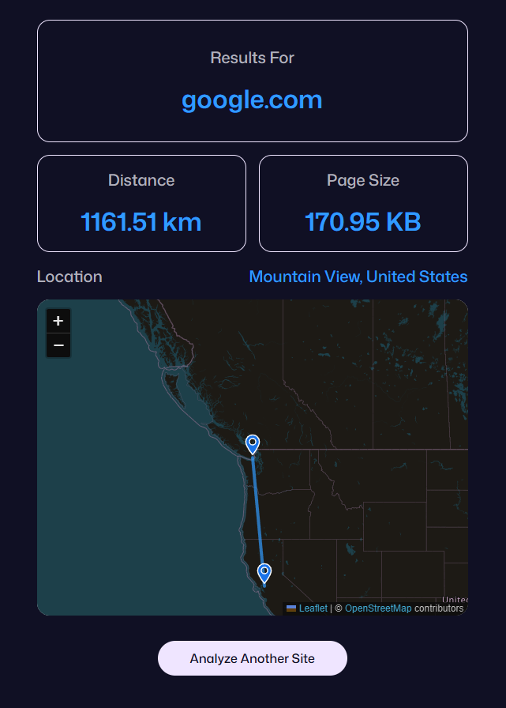

## HopSpan - Discover Where in the World a Website Lives

HopSpan is a web tool that reveals the physical location of any website’s server, measures the distance from your device, and estimates how heavy the site is to load. It's built to give users a deeper understanding of web performance and infrastructure, all through a simple, visual interface.

### Input Page

### Result Page

